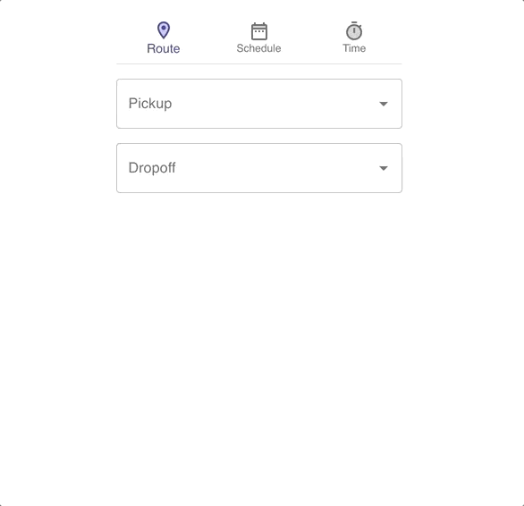
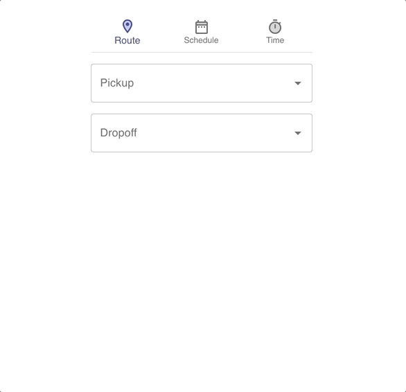
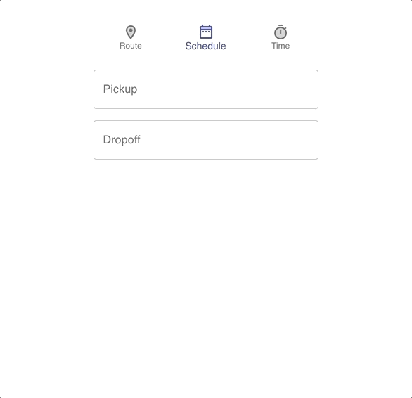

# Fare Estimator for Gig Car Share

I built this single-page React app to demo how [Gig Car Share](https://gigcarshare.com/) could allow users to view price estimates based on an inputted _route_, _schedule_, or _time_. Gig charges by the [minute, hour, or day](https://gigcarshare.com/rates/) with various caps based on the amount of time elapsed. The app does all of this nasty math for you! 

A live version of the app can be viewed [here](https://fareestimator.herokuapp.com/).

## Demo

### Route

User can input pickup and dropoff lcoations. 

The Mapbox geocoding API is called to populate search results and the Mapbox Directions API is called to determine the driving time between the two locations.



### Schedule

User can input pickup and dropoff datetimes.



### Time

User can input minutes, hours, and days.

Note how the estimate correctly accounts for the $15 per hour, $55 per 8 hours, and $85 per day pricing caps. 



## Built With

* [React](https://reactjs.org/)
* [Create-React-App](https://create-react-app.dev/)
* [Material-UI](https://material-ui.com/)
* [Material-UI Pickers](https://material-ui-pickers.dev/)
* [Mapbox](https://www.mapbox.com/)

## Getting Started

From the root directory, ```npm install``` to install all dependencies. 

Update ```MAPBOX_TOKEN``` in [App.js](src/App.js) with your own public Mapbox token.

```npm run start``` will get the local server running.

## Components Overview

* ```FareNavigation``` - The navigation bar at the top of the app; see Material-UI's [Bottom Navigation](https://material-ui.com/components/bottom-navigation/).
* ```Route``` - The two input boxes that query the Mapbox Geocoding API and show results as a dropdown; see Material-UI's [Autocomplete](https://material-ui.com/components/autocomplete/).
* ```Schedule``` - Houses both DatePicker components.
* ```DatePicker``` - Inputs for DateTime that open calendar selectors; see [Material-UI Pickers](https://material-ui-pickers.dev/).
* ```Time``` - Inputs for minutes, hours, days; see Material-UI's [Text Field](https://material-ui.com/components/text-fields/).
* ```Receipt``` - Visualizes price as a table; see Material-UI's [Table](https://material-ui.com/components/tables/).

## Tests

